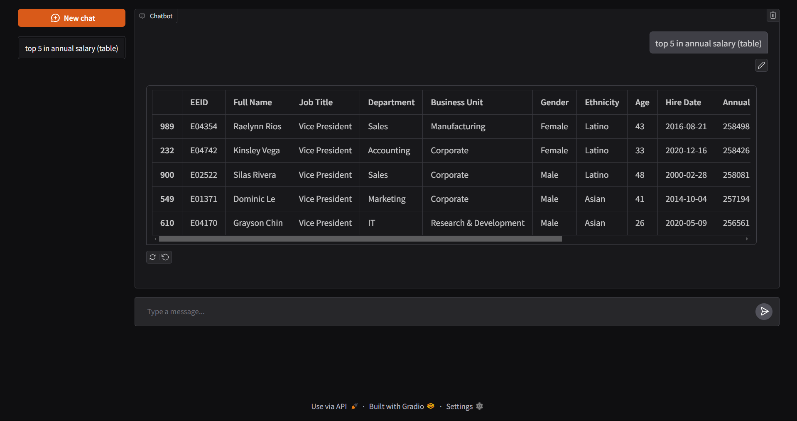

# 📊 Data Analysis Agent



This is a data analysis chatbot built using [PandasAI](https://github.com/sinaptik-ai/pandas-ai) and [Gradio](https://www.gradio.app/). It handles questions about your data (.xlsx, .csv, .json, .xml) and generates text, charts, or tables based on the data that you provide.

## Local Setup

1. Clone the repository using Git or Github CLI.

2. Create a virtual environment and activate it.

3. Install the required dependencies:

   ```sh
   pip install -r requirements.txt
   ```

4. Rename `.env.example` file to `.env` and add your variables.

5. Run the gradio app using:
   ```sh
   python app.py
   ```

## License

This project is licensed under the MIT License. See the [LICENSE](./LICENSE) file for details.
